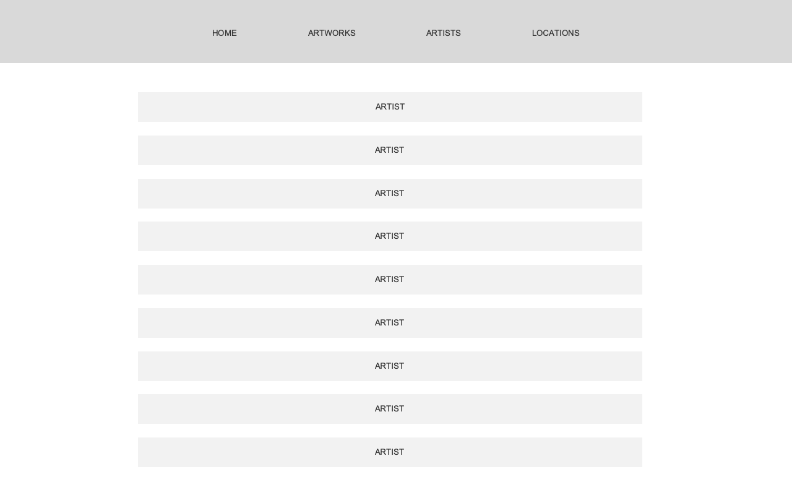
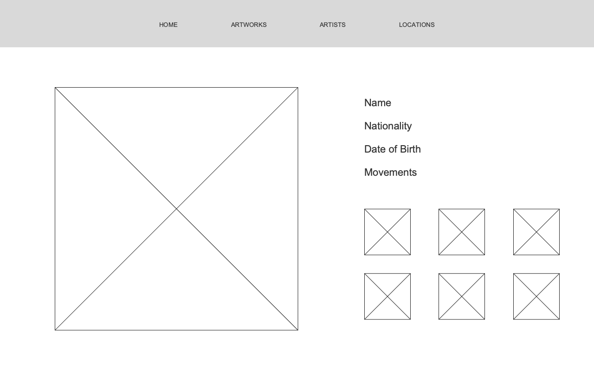

# Capstone Project 
#### By Fran Brauning

## Project Summary

A web app where a user can create an inventory of historical artworks, their artists, and locations to keep track of art they are interested in and where to visit to view the art.

## Models

### Artwork
- title = models.CharField(max_length=50)
- artist = models.ForeignKey(Artist)
- year = models.IntegerField()
- medium = models.CharField(max_length=50)
- image = models.CharField(max_length=255)
- location = models.ForeignKey(Location)

### Artist
- name = models.CharField(max_length=50)
- nationality = models.CharField(max_length=50)
- dob = models.CharField(max_length=50)
- movement = models.CharField(max_length=255)

### Location
- name = models.CharField(max_length=50)
- type = models.CharField(max_length=50)
- city = models.CharField(max_length=50)
- country = models.CharField(max_length=50)
- website = models.CharField(max_length=255)

## Route Table

List your routes in a table

| url | method | action |
|-----|--------|--------|
| /artworks | GET | get all artworks (index) |
| /artworks | POST | add an artwork (create)|
| /artworks/:id | PUT | update an artwork (update)|
| /artworks/:id | DELETE | delete an artwork (destroy)|
| /artists | GET | get all artists (index) |
| /artists | POST | add an artist (create)|
| /artists/:id | PUT | update an artist (update)|
| /artists/:id | DELETE | delete an artist (destroy)|
| /locations | GET | get all locations (index) |
| /locations | POST | add a location (create)|
| /locations/:id | PUT | update a location (update)|
| /locations/:id | DELETE | delete a location (destroy)|

## User Stories

- As a user I can see a list of artworks
- As a user I can add a new artwork
- As a user I can click on an artwork and see a page with the artwork information
- As a user I can edit an artwork
- As a user I can delete an artwork
- As a user I can see a list of artists
- As a user I can click on an artist and see a page with the artist information and list of artworks by   the artist
- As a user I can add a new artist
- As a user I can edit an artist
- As a user I can delete an artist
- As a user I can see a list of museums/galleries
- As a user I can click on a museum/gallery and see a page with the museum/gallery information
- As a user I can add a new museum/gallery
- As a user I can edit a museum/gallery
- As a user I can delete a museum/gallery

## Wireframe

[]
[]
[]
[]
[]
[]

## Components

- Header (Component)
- Footer (Component)
- Artwork (Component)
- Artist (Component)
- Location (Component)
- Modal (Component)
- ArtworkForm (Component)
- ArtistForm (Component)
- LocationForm (Component)
- AllArtworks (Page)
- SingleArtwork (Page)
- AllArtists (Page)
- SingleArtist (Page)
- AllLocations (Page)
- SingleLocation (Page)

## Components Architecture

```
--> App
    --> Header
    --> Routes
        --> AllArtworks
            --> Artwork
            --> Modal
                --> ArtworkForm
        --> SingleArtwork
            --> Modal
                --> ArtworkForm
        --> AllArtists
            --> Artist
            --> Modal
                --> ArtistForm
        --> SingleArtist
            --> Modal
                --> ArtistForm
        --> AllLocations
            --> Location
            --> Modal
                --> LocationForm
        --> SingleLocation
            --> Modal
                --> LocationForm
    --> Footer
```

## List of Technologies

### Backend
- Python
- Django
- Django Rest Framework
- Postgres

### Frontend
- JS
- CSS
- HTML
- ReactJS
